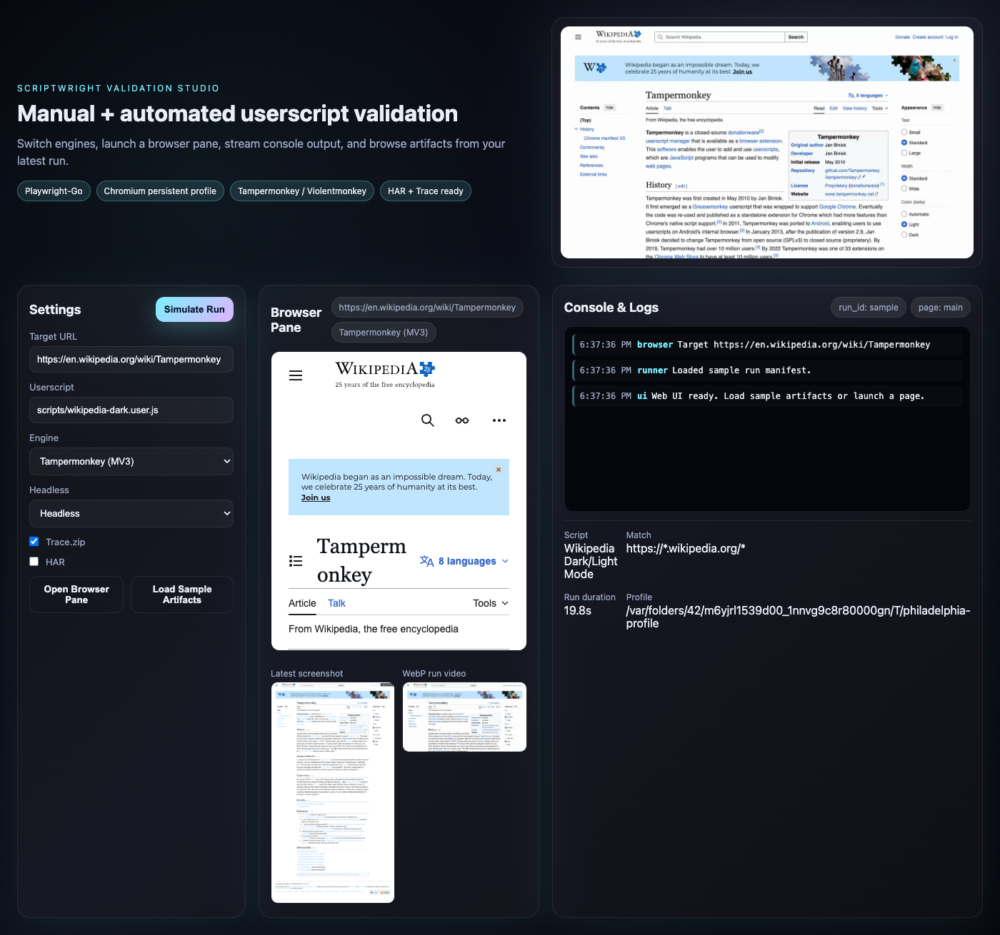

# Scriptwright Validation Studio — Userscript Test Lab

      

<p align="center">
  
</p>

## Why this exists
A desktop-first lab for validating real userscripts with real engines (Tampermonkey/Violentmonkey) using Playwright-Go. It mirrors the spec/roadmap in `spec.md` and `roadmap.md`: persistent Chromium context, bundled extensions, rich artifacts (logs, HAR, traces, screenshots, video), and a pro debugging console.

## Demo recipe (15–20s)
1) Install native deps: `brew install ffmpeg webp`  
2) Run the sample flow: `go run ./cmd/demo`  
3) Open the generated assets in `artifacts/`:
   - `wikipedia-dark.webp` — animated walkthrough (wow factor starter for the README)
   - `wikipedia-dark.png` — full-page screenshot post-toggle  
   - `run.json` — manifest with parsed userscript metadata and run timings

## Web UI prototype (manual + future automated)
<p align="center">
  
</p>

- Launch locally:  
  - Open `webui/index.html` directly, or serve the repo root: `python -m http.server 8000` then visit `http://localhost:8000/webui/`.  
  - Click **Load Sample Artifacts** to hydrate the console and preview with the latest demo run.  
  - Use **Open Browser Pane** to point the embedded iframe at any URL and tweak engine/headless toggles (console shows the simulated flow).  
- Capture an updated UI screenshot for docs: `go run ./cmd/capture_ui` (writes `artifacts/webui.png`).

## How the demo works
- **Persistent Chromium**: launches via Playwright with video recording enabled for all pages.  
- **Userscript ingestion**: `internal/userscript` parses the `// ==UserScript==` block (name, namespace, version, match, grants, raw).  
- **Injection strategy**: the userscript is executed after navigation to `https://en.wikipedia.org/wiki/Tampermonkey`, then the “Toggle Dark Mode” UI is exercised.  
- **Artifacts**: video captured as WebM → converted to WebP for README; PNG screenshot for baseline/visual assertions; manifest captures timing + profile location for debugging.  
- **Resilience**: video conversion first tries `ffmpeg` with `libwebp` and falls back to `img2webp` frame assembly so the demo succeeds on typical macOS setups.

## Files to know
- `cmd/demo/main.go` — minimal end-to-end runner with capture + conversion.
- `cmd/capture_ui/main.go` — grabs a fresh screenshot of the web UI shell.
- `internal/userscript/parser.go` — metadata parser with unit test.
- `webui/` — static prototype UI with settings, browser pane, console, and artifact previews.
- `scripts/wikipedia-dark.user.js` — sample GreasyFork script (v1.8) used by the demo.
- `artifacts/` — generated showcase assets that feed the README hero + UI preview.

## Extending toward the roadmap
- Swap the target URL or script path to exercise other userscripts (e.g., different matches or grant sets).  
- Wire checklist assertions: use Playwright expect-style checks after the toggle to move toward the acceptance criteria in `spec.md`.  
- Add HAR/trace hooks (per spec §6/§9) by enabling Playwright tracing and HAR recording on the context.  
- Integrate TM/VM extension loading by replacing the current init-script injection with a real extension install once the bundled MV3 artifacts are available.  
- Surface artifacts in a React/TS UI matching the “Run dashboard” and “Debug console” requirements.

## Running tests
```bash
go test ./...
```

## License
Blue Oak Model License 1.0.0 — see `LICENSE`.
